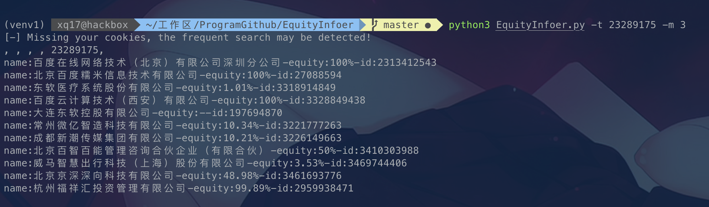
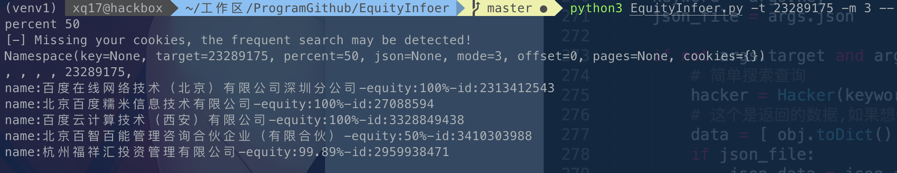

# EquityInfoer
快速获取天眼查中目标公司的基础数据和股权穿透信息。

## Feature

1.自动模拟搜索过程,通过自定义关键字、偏移页数、查找页数,支持输出json格式的数据

2.能够针对单一目标,快速提取基本信息和股权穿透信息


## Installtion

```
git clone https://github.com/mstxq17/EquityInfoer.git
cd ./EquityInfoer && pip3 install -r  requirements.txt
```


## Usage

**1.查看帮助**

`python3 EquityInfoer.py -h`

>```
>usage: EquityInfoer.py [-h] [-key KEY] [-t TARGET] [--percent PERCENT] [--json JSON] [-m MODE] [-o OFFSET]
>                       [-p PAGES] [-c COOKIES]
>
>optional arguments:
>  -h, --help            show this help message and exit
>  -key KEY              search query
>  -t TARGET             company's identity,like 22822(baidu.com)
>  --percent PERCENT     specify percent equity,degfault 0
>  --json JSON           output reult to json type
>  -m MODE, --mode MODE  1: info 2.equity 3.all
>  -o OFFSET, --offset OFFSET
>                        page offset to start from
>  -p PAGES, --pages PAGES
>                        specify multiple pages
>  -c COOKIES, --cookies COOKIES
>                        specify your cookies
>```

**2.模拟搜索,指定搜索关键字为百度的天眼查0到1页中结果并且保存到data.json**

```
python3 EquityInfoer.py -key "百度" -o 0 -p 1 --json data.json
```

如果出现

```
 python3 EquityInfoer.py -key "百度" -o 0 -p 1 --json data.json
[-] Missing your cookies, the frequent search may be detected!
[-] get_total Failed!
[+] total page:0
[+] Now searching 百度 keyword from 0 to 1
[+] Success explored 0 relevant companies!
```

这个时候建议带上cookie

`python3 EquityInfoer.py -key "百度" --cookie "这里填burp抓包得到的地址"  -o 0 -p 1 --json data.json`


**3.指定目标进行搜索**

先通过天眼查获取到目标的id,如[https://www.tianyancha.com/company/23289175](https://www.tianyancha.com/company/23289175)

那么id就是`23289175`

```
# m=1 查询基础信息 m=2 查询股权信息 m=3 查询基础信息+股权信息
python3 EquityInfoer.py -t 23289175 -m 1
python3 EquityInfoer.py -t 23289175 -m 2
python3 EquityInfoer.py -t 23289175 -m 3
```



***出现显示信息不完全，很有可能就是访问太频繁了,这个时候你可能需要进行登录,获取cookie带入**

`python3 EquityInfoer.py -t 23289175 -m 3 --cookie "burp或者浏览器直接复制cookie字符串下来就行"`


**4.支持过滤指定股权比例资产**

```
过滤股权占比>=50%的资产
python3 EquityInfoer.py -t 23289175 -m 3 --percent
```




## TODO

- [ ] cookie登录状态可以考虑增加多线程，这样可以提高很多模拟搜索功能的速度
- [ ] 增加递归查询股权结构的功能，可以自定义深度
- [ ] 增加股权结构的域名获取和导出功能，方便导入扫描器


